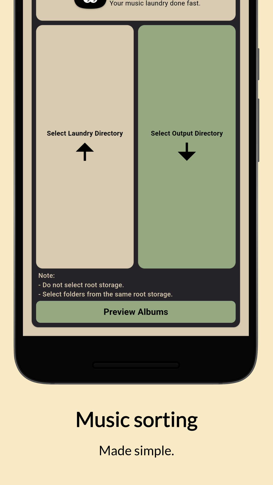

# Laundromat

A simple Music Folder Sorting Utility for Android.

- Select Laundry Folder
- Select Output Folder
- Preview/Review and Confirm
- Done.

## Screenshot

## To-Do
- Some refactoring
- Cross-Storage sorting
- Other sorting options

## Feedback and Contributions
- Welcome